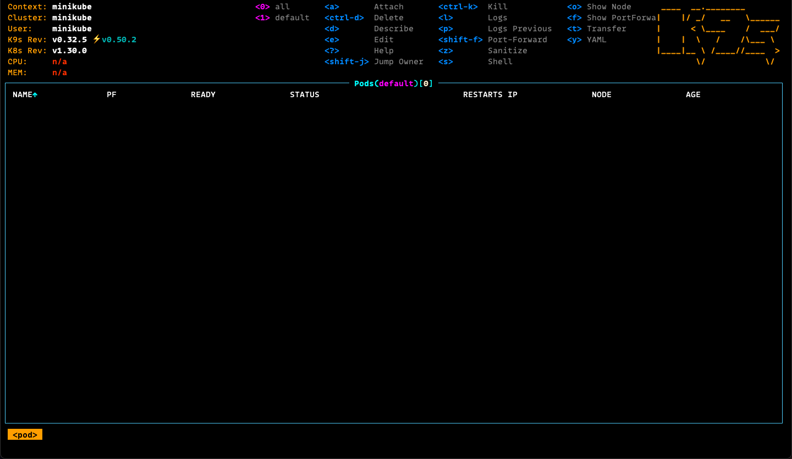

# Cluster

A cluster is a set of nodes that run containerized applications
managed by Kubernetes. It provides the necessary infrastructure to deploy,
manage, and scale applications in a containerized environment.

### Create a Kubernetes Cluster

Create a Kubernetes Cluster using `minikube`.

```sh
minikube start
```

> The provided cluster will use around 2 GB RAM of memory and 2 CPUs
> you can see this in the output from the `minikube start` command.
> ```sh
> Creating docker container (CPUs=2, Memory=2200MB)
> ```

### Create a Kubernetes Cluster with Resources

The start command support different options for Cluster creation.

```sh
minikube start --cpus=4 \
    --memory=4400 \
    --kubernetes-version=v1.30.0
```

### Kubernetes Node Status Check

Check on the active cluster using `kubectl` CLI with the `get node` subcommands.

```sh
kubectl get node
```

### Cluster Info Retrieval

Furter commands will run against the active Kubernetes namespace.

```sh
kubectl cluster-info
Kubernetes control plane is running at https://127.0.0.1:32769
CoreDNS is running at https://127.0.0.1:32769/api/v1/namespaces/kube-system/services/kube-dns:dns/proxy

To further debug and diagnose cluster problems, use 'kubectl cluster-info dump'.
```

### Switch Kubernetes Context

A Kubernetes context is a configuration that defines the cluster,
user and namespace that `kubectl` will use when executing commands.

```sh
kubectx minikube
```

### Inspect Kubernetes Resources

You can use `k9s` to inspect into active Cluster resources.


