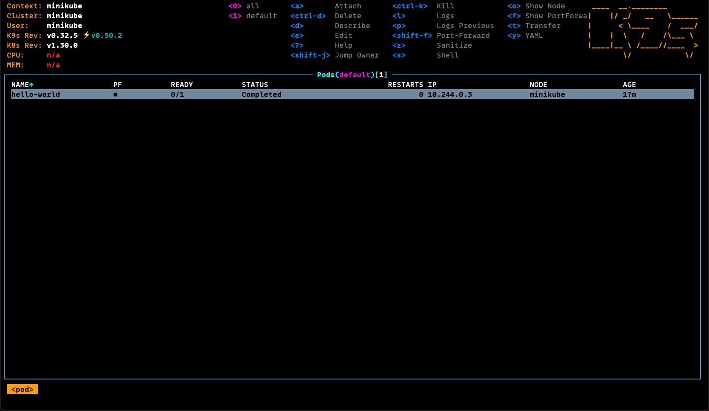
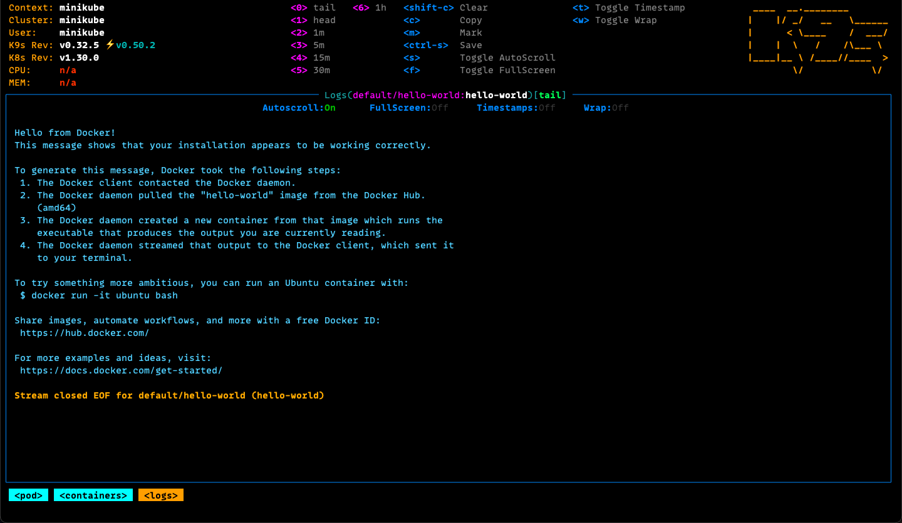

# Pods

A Kubernets pod is the smallest and simplest deployable unit.

A pod represents a single instance of a running process in your cluster
and can contain one or more containers that share the same network namespace
and storage resources.

### Run Docker's "Hello World" on Kubernetes

Docker images can run in Kubernetes as pods, the following command runs
the `hello-world` image from Docker's Hub in Kubernetes.

This image runs its process which outputs text to the `stdout` and then
exits with success code.

The `--restart` parameter specifies that after exiting the program should
not rerun.

The `--image` parameter specifies the name of the image to pull.

The `-it` paremeter sets two options:
  - `i`: Interactive, allows to interact with `stdin`.
  - `t`: The `tty` option allocates a pseudo-terminal for interactive sessions.

With `-it` we can see the output in the terminal.

```sh
kubectl run hello-world \
    --restart=Never \
    --image=hello-world \
    -it
```

### Process Logs

In regular use cases, the `-it` option is not likely to be used, instead
output is kept in the runtime context for the pod.

The `logs` subcommand can be used to check on `hello-world` pod logs.

```sh
kubectl logs hello-world
```

### List Pods

```sh
kubectl get pod
```

The command will list every cluster pods.

```
NAME                    READY   STATUS      RESTARTS      AGE
hello-world
```

### Inspect on Pod Details

Retrieve more details on a pod using the `describe pod` subcommand.

```sh
kubectl describe pod hello-world
```

### Delete Pod

Once a pod is no longer needed, it can be deleted with `pod delete` subcommand.

```sh
kubectl delete pod hello-world
```

### Inspect on Pod's using k9s

k9s will list Pods available in the Cluster.



Logs for the pod can be seen using the k9s interface.


